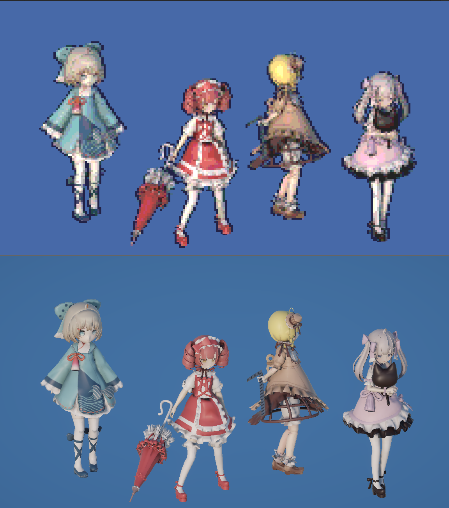

# Pixel Art Shader for Unity

このプロジェクトは、UnityのURP (Universal Render Pipeline) に対応した**ピクセルアート風エフェクトのシェーダー**です。  
Shader Graphで構成されており、ポスタライズやエッジ抽出を活用して、3Dシーンをドット風に描画できます。

---

## 📁 含まれるファイル

Assets/
└── PixelArtShader/
├── PixelArt.shadergraph ← シェーダー本体
└── PixelArtMaterial.mat ← フルスクリーンパス用マテリアル

ルート/
└── pixelArt.png ← プレビュー画像（README用）

---

## 🔧 対応環境

- Unity バージョン：**6000 以降（2023.1系相当）**
- パイプライン：**Universal Render Pipeline（URP）**
- モード：**3Dプロジェクト**

---

## 🚀 導入手順

1. Unityの URP 設定を開きます  
   `Assets > Settings > PC_Renderer.asset` を選択
2. 最下部にある `Add Renderer Feature` をクリック
3. `Full Screen Pass Renderer Feature` を追加
4. `Pass Material` に `PixelArtMaterial.mat` を指定

---

## 🎛️ シェーダーパラメータ説明

| パラメータ名 | 説明 |
|--------------|------|
| **Pixel** | 画面全体のY方向のピクセル数を指定します（例：180） |
| **ScreenRate** | 画面サイズ比やアスペクト比を入力します（例：1.777） |
| **DepthEdge** | 深度差による輪郭の閾値。大きくすると輪郭が太くなります |
| **NormalEdge** | 法線（勾配）差による輪郭の閾値。敏感に反応するようになります |
| **DepthEdgeColorMultiplier** | 深度輪郭に乗算される色の強さ |
| **NormalEdgeColorMultiplier** | 勾配輪郭に乗算される色の強さ |

---

## ⚠ 注意事項

- 本シェーダーは **ノーマルマップの情報**を使用するため、`Unlit` マテリアルでは一部機能が正しく動作しません。
- 使用するマテリアルは **`Lit` などノーマルマップが有効なもの**である必要があります。

---

## 📝 ライセンス

このシェーダーは **MIT ライセンス**のもとで公開されています。  
自由に使用・改変・再配布できますが、著作権表示とライセンス文を保持してください。

[MIT License](LICENSE)